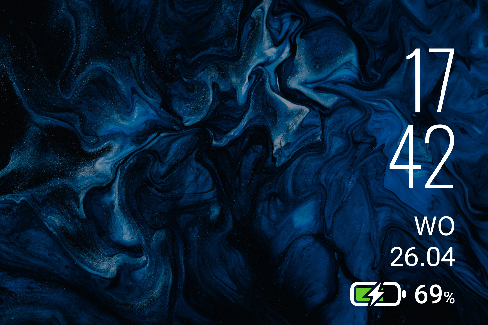

# MIUI AlwaysOn

  

Heavily inspired by the always-on display on my Poco F3 back when I had MIUI installed on it. I've tried to recreate the battery icon as well as possible, and there are three different styles for the icon. Obviously, the battery icon only works properly on laptops.

----

## Installation

1. Download and install the latest version of [Rainmeter](https://www.rainmeter.net/).  
2. Download the [skin](https://github.com/adriaanjelle/MIUI-AlwaysOn/releases/latest) and open the .rmskin file (it should have a green raindrop icon).  
3. Done!
